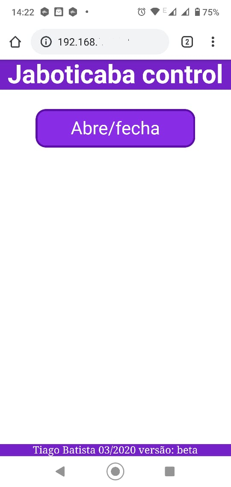

# JaboticabaControl
O Jaboticaba Control é um webserver simplificado para acionamento de cargas com uso de um rele, ele foi projetado para acionar a boteira do portão eletronico, acionado via TCP_IP, abaixo uma imagem da pagina do Webserver

